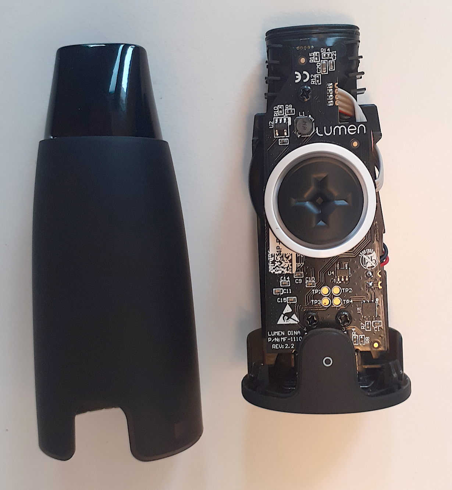
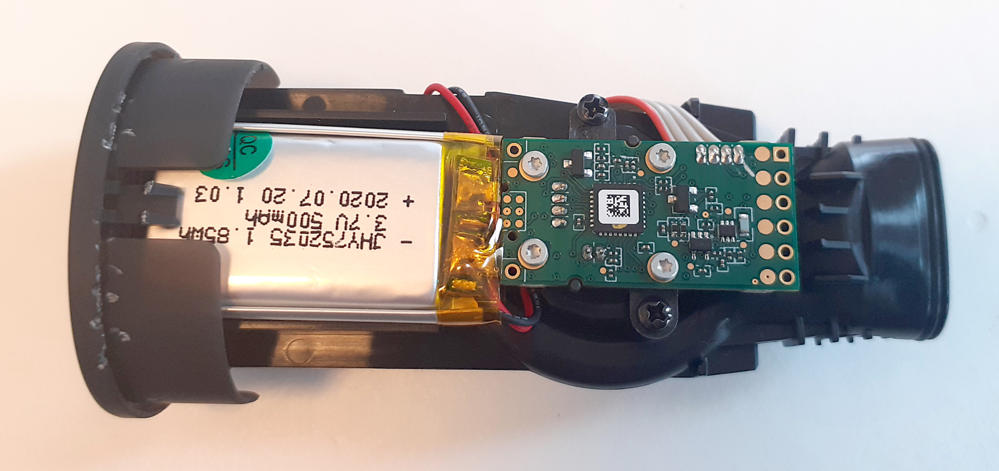
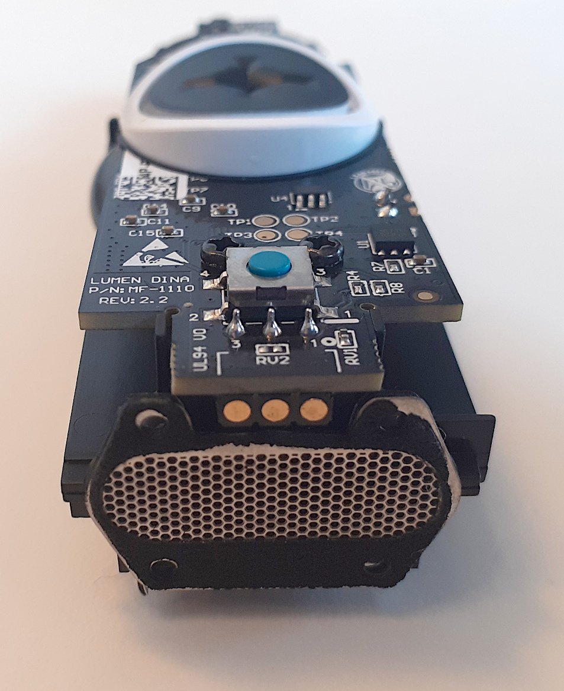
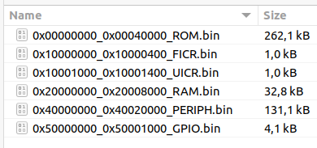

On this repository I am documenting the information I found about the "Lumen - The first device to hack your metabolism" that I bought on the product page: https://www.lumen.me/ 

I hope this information is useful for you in the case you need to repair your Lumen or simple want to understand how it works.

My first unit had an issue that I saw reported by many others, that it stopped to turn on and charge - the company promptly sent me a new unit.

Here is the graph of my second week testing keto diet as also Ketonix:

# Ideas for future

- understand how can we access on the raw measured data on the Bluetooth and make our own app

# Main board

This is the main board of Lumen (bought on December 2020):

See more pictures on the [documentation]() folder.

The main board uses the famous Nordic nRF51822 Bluetooth microcontroller:
* Nordic nRF51822 SoC supports both BLE Central and BLE Peripheral roles
* Ultra low power ARM Cortex-M0 Core
* Support voltage from 1.8V to 3.3V
* 16MHz, 256KB Flash, 16KB RAM
* SWD Interface for nRF51822

If you are interested, [there are ways to dump the protected firmware from the nRF51822](http://hfdb.io/cpumcus/nordic-semi/nrf51822.html).

Some notes:
* the board power comes directly from the 5V on USB
* the sensor pins are:
  * BROWN wire: 5V USB
  * RED wire: GND
  * YELLOW wire: analog signal
* red board with nRF51822
  * P0.4 controls directly the blue LED
  * P0.5 is pin for input of sensor analog signal

Seems there is a kind of opamp under the red board that does an attenuation of the sensor signal by 0,577 (for instance: sensor analog signal = 520mv and nRF51822 P0.5 pin = 300mv).

# Firmware

The original firmware were dumped using the tool [nrfsec](https://github.com/buildxyz-git/nrfsec/) - although the firmware was not protected:

Find it on the [firmware_lumen-01.2021](/firmware_lumen-01.2021) folder.

