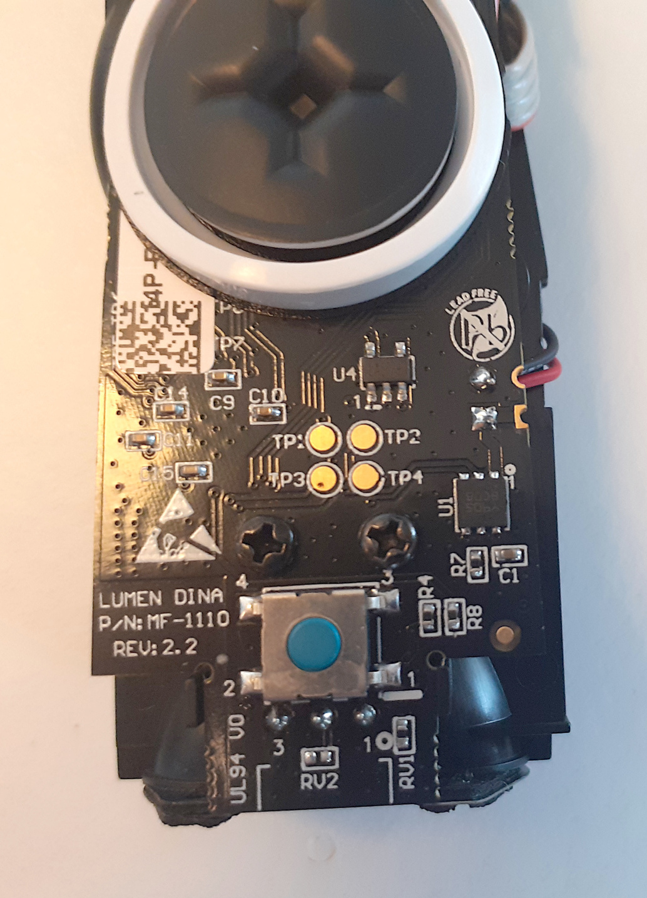
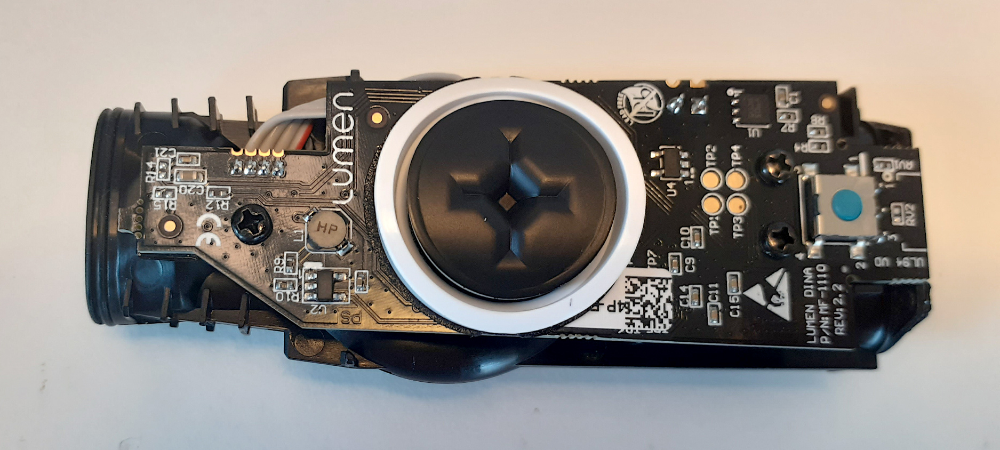

On this repository I am documenting the information I found about the "Lumen - The first device to hack your metabolism" that I bought on the product page: https://www.lumen.me/ 

I hope this information is useful for you in the case you need to repair your Lumen or simple want to understand how it works.

My first unit had an issue that I saw reported by many others, that it stopped to turn on and charge - the company promptly sent me a new unit.

# Ideas for future

- understand how can we access on the raw measured data on the Bluetooth and make our own app

# Firmware

The original firmware were dumped using the tool [nrfsec](https://github.com/buildxyz-git/nrfsec/) - although the firmware was not protected:

Find it on the [firmware_lumen-01.2021](/firmware_lumen-01.2021) folder.

For disassembly you can try Ghidra or Cutter / radare.

# Main board

The main board uses the famous Nordic nRF51822 Bluetooth microcontroller:
* Nordic nRF51822 SoC supports both BLE Central and BLE Peripheral roles
* Ultra low power ARM Cortex-M0 Core
* Support voltage from 1.8V to 3.3V
* 16MHz, 256KB Flash, 16KB RAM
* SWD Interface for nRF51822

There is another board  that seems to only measure the air blow sensor, probably a rotation sensor. This board has the M16M6V (possible the Freescale MKL16Z64).

This is the main board of Lumen (bought on December 2020):

See more pictures on the [documentation]() folder.

When we blow the air, seems it divides in two paths, the main path seems to have a sensor that rotates and there is the IC M16M6V that seems to measure the rotation of the air sensor. 
As you can see, there is also a very small sensor with a tiny hole - I guess this is the CO2 sensor:

The charging dock - the middle pin (as seen on J2) goes to one pin of the microcontroller NRF51, maybe this is some output line data like UART TX for sending data for some calibration or such during the manufacturing: 

